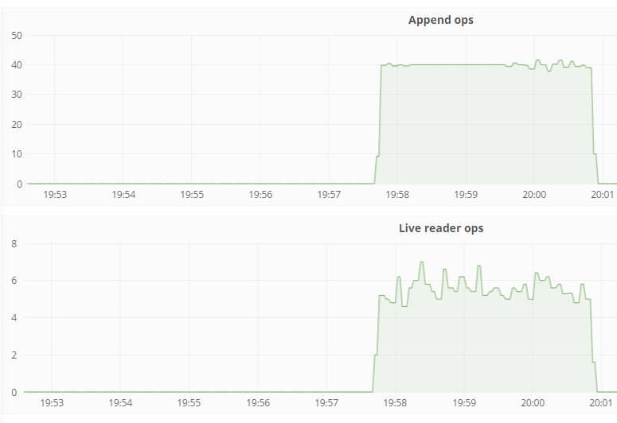

Operating
=========

Metrics
-------

Metrics are exposed via [Prometheus](https://prometheus.io/)-compatible API at `/metrics`.

Full list of metrics at [writer/metrics.go](../writer/metrics.go)

You can debug those metrics from command line by running:

```
$ curl -s http://localhost:9094/metrics | egrep -v '(#|go_|process_)'
```

The metrics are best viewed in Grafana or Prometheus:



I recommend using the `irate()` (over 1 minute) in Prometheus query for
gauge-type metrics. Example:

```
irate(live_reader_read_ops[1m])
```

`irate()` reacts faster than `rate()` and requires only one sample to backtrack.
Therefore for scrape interval of `5s` you could irate() with `10s` but let's
use `1m` for safety (if scraping has delays) - it's a maximum anyway.
